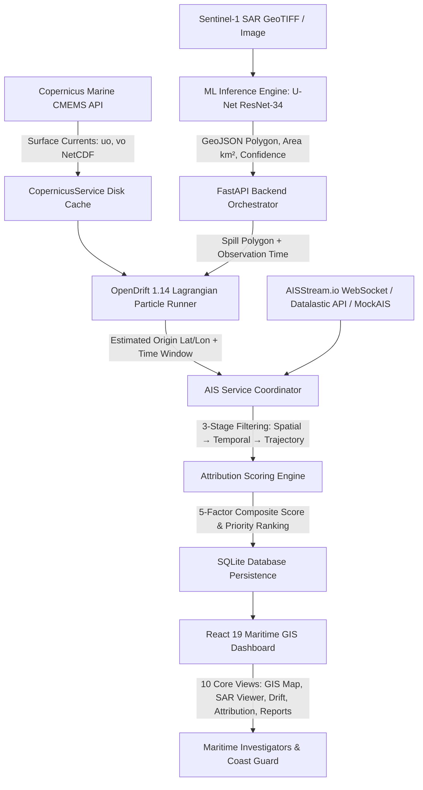

# 🛰️ MarineTrace — Master System Architecture & Workspace Context

> **Official Comprehensive System Context Document (`context.md`)**
> This document serves as the single source of truth for AI agents (Antigravity, Gemini, Claude, Cursor, Copilot) and human engineers working in this repository or setting up another workspace.
> It details the end-to-end architecture, domain algorithms, ML pipeline, physical oceanographic simulation, AIS tracking, attribution mathematics, REST APIs, frontend GIS command center, and exact reproduction runbooks.

---

## 🗺️ 1. System Overview & Mission

MarineTrace is an **AI-powered marine oil-spill detection and vessel attribution platform** built for **Smart India Hackathon 2026**.

When an oil spill occurs at sea, rapid detection, accurate backward drift reconstruction, and vessel attribution are critical for environmental response and forensic investigation. MarineTrace provides an integrated, fully automated pipeline:
1. **SAR Satellite Detection**: Identifies slick boundaries and calculates geographic polygon geometries from Sentinel-1 C-band Synthetic Aperture Radar (SAR) dual-polarization imagery ($\sigma_{VV}^0, \sigma_{VH}^0$) using a PyTorch U-Net (ResNet-34 backbone).
2. **Physical Metocean Drift Simulation**: Simulates reverse (backtracking) ocean drift driven by real-time Copernicus Marine surface currents ($u_o, v_o$) via OpenDrift 1.14 to accurately pinpoint the spill release origin point ($L_0, \lambda_0$) and time window ($T_0$). Also forecasts 48-hour forward slick spreading and trajectory.
3. **Multi-Provider AIS Ingestion**: Pulls historical and real-time Automatic Identification System (AIS) vessel tracking data from AISStream.io (live WebSocket), Datalastic API, or deterministic scenario fallbacks.
4. **Explainable 5-Factor Attribution Engine**: Applies a multi-dimensional mathematical scoring model (Spatial Proximity 30%, Temporal Alignment 25%, Trajectory Correlation 20%, Behavioural Anomalies 15%, Vessel Risk Relevance 10%) to prioritize potential source vessels with natural language forensic justification.
5. **Maritime GIS Command Center**: A modern React 19 + TypeScript + Vite 6 dashboard with Leaflet GIS mapping, SAR raster layer inspection, attribution radar charts, role-based access control, and forensic reporting.

> **Legal Disclaimer**: MarineTrace provides investigative decision-support and priority ranking only — not definitive legal adjudication.

---

## 🏛️ 2. High-Level System Architecture & Data Flow



---

## 🏗️ 3. Technology Stack Inventory

| Subsystem | Component | Technologies & Versions |
| :--- | :--- | :--- |
| **ML Engine** | SAR Oil Slick Segmentation | PyTorch 2.13, `segmentation-models-pytorch` 0.5, U-Net (ResNet-34 backbone, 24.4M params), MPS GPU / CUDA / CPU |
| **Backend API** | REST API & WebSocket Feeds | FastAPI, Uvicorn, Pydantic v2, Python 3.10+, SQLite (`aiosqlite`), `httpx`, `websockets` |
| **Metocean Currents** | Ocean Surface Currents | **Copernicus Marine Service** (`cmems_mod_glo_phy-cur_anfc_0.083deg_P1D-m`, `uo`, `vo` velocity vectors) |
| **Drift Modeling** | Lagrangian Particle Simulation | **OpenDrift 1.14** (`OceanDrift`) + NetCDF generic CF reader + Geometric fallback |
| **AIS Tracking** | Multi-Provider Ingestion | **AISStream.io** (WebSocket) + **Datalastic API** + Deterministic **MockAISClient** |
| **Attribution** | Suspect Prioritization | 5-Factor Mathematical Model ($S=30\%, T=25\%, Tr=20\%, B=15\%, R=10\%$) |
| **Frontend UI** | Maritime GIS Command Center | React 19, TypeScript 5, Vite 6, Leaflet GIS (`react-leaflet` 5), TailwindCSS v4, Recharts, Lucide Icons |
| **Persistence** | Investigation Storage | SQLite (`marinetrace.db`) with async repository pattern |
| **Testing** | Automated Quality Assurance | Pytest (30 backend integration tests + 36 ML pipeline tests = **66 Total Tests**) |

---

## 📁 4. Complete Repository Directory Layout

```
MarineTrace/
├── CONTEXT.md                       # Master workspace context & architecture document
├── context.md                       # Master workspace context mirror (lowercase)
├── AGENTS.md                        # Master AI agent context file
├── GEMINI.md                        # Gemini / workspace context mirror
├── PROJECT_STRUCTURE.md             # In-depth architectural layout & component inventory
├── README.md                        # Project landing documentation & quickstart
├── package.json                     # Root npm script delegation to frontend
├── docker-compose.yml               # Multi-container orchestration (FastAPI backend service)
├── run_demo.py                      # Standalone zero-setup CLI demonstration runner
├── marinetrace.db                   # SQLite investigation persistence database
├── .env.example                     # Environment configuration template
│
├── backend/                         # 🐍 FastAPI Backend Application
│   ├── app/
│   │   ├── main.py                  # API entry point, lifespan, & CORS configuration
│   │   ├── api/
│   │   │   ├── dependencies.py      # Dependency injection providers
│   │   │   └── routes/              # REST endpoint routes
│   │   │       ├── health.py        # /ping health check probe
│   │   │       ├── investigation.py # /investigate, /demo/investigation, /detect, /investigations
│   │   │       ├── drift.py         # /drift/backward, /drift/forward standalone endpoints
│   │   │       └── vessels.py       # /vessels/search, /vessels/status AIS query endpoints
│   │   ├── core/
│   │   │   ├── config.py            # Pydantic BaseSettings loading from .env
│   │   │   └── logging.py           # Structured logging formatters & level handlers
│   │   ├── db/
│   │   │   └── repository.py        # SQLite asynchronous repository (aiosqlite)
│   │   ├── models/                  # Pydantic schemas & GeoJSON serialization
│   │   │   ├── drift.py             # DriftResult, DriftTrajectory, DriftOrigin, DriftTimeWindow
│   │   │   ├── investigation.py     # InvestigationRequest, InvestigationResponse, InvestigationStatus
│   │   │   ├── spill.py             # SpillDetection, SpillSummary, GeoJSONGeometry
│   │   │   └── vessel.py            # VesselTrack, VesselPosition, FeatureScores, VesselAttribution
│   │   ├── services/                # Domain business logic coordinators
│   │   │   ├── ml_client.py         # RealMLClient (direct U-Net) & MockMLClient
│   │   │   ├── ais_service.py       # Multi-provider AIS coordinator & 3-stage filter
│   │   │   ├── copernicus_service.py# Copernicus Marine current fetching & NetCDF disk caching
│   │   │   ├── drift_service.py     # OpenDrift & geometric metocean drift simulation
│   │   │   ├── environmental_service.py # Metocean environmental data coordinator
│   │   │   └── attribution_service.py # 5-factor mathematical attribution engine
│   │   └── utils/                   # Geodesic math, bounding box expansion, time helpers
│   │       ├── geo.py               # Haversine, polygon distance, bounding box calculation
│   │       └── time.py              # ISO-8601 parsing & time window helpers
│   ├── ais/                         # AIS Tracking Engine
│   │   ├── client.py                # AISStreamClient, DatalasticClient, MockAISClient
│   │   ├── filtering.py             # 3-Stage filtering pipeline (Spatial, Temporal, Trajectory)
│   │   └── trajectory.py            # Trajectory interpolation, course, & speed anomaly detection
│   ├── attribution/                 # Attribution Engine
│   │   ├── features.py              # 5-factor feature extractors (Spatial, Temporal, Trajectory, Behaviour, Relevance)
│   │   ├── scoring.py               # Weighted composite scoring & priority calculation
│   │   └── ranking.py               # Candidate ranking & natural language justification generator
│   ├── data/
│   │   ├── copernicus/              # Cached Copernicus Marine NetCDF current grids (*.nc)
│   │   └── demo/                    # Pre-cached demonstration scenarios
│   ├── drift/                       # Drift Modeling
│   │   ├── backtracking.py          # Reverse Lagrangian particle simulation to locate spill origin
│   │   ├── forecasting.py           # Forward trajectory forecasting for containment planning
│   │   └── opendrift_runner.py      # Physical OpenDrift model runner with NetCDF forcing
│   ├── tests/                       # 30 automated pytest tests (all passing)
│   │   ├── test_ais.py              # AIS mock generation & filtering tests
│   │   ├── test_api.py              # API endpoint smoke tests
│   │   ├── test_attribution.py      # 5-factor mathematical scoring tests
│   │   ├── test_copernicus_opendrift.py # Real Copernicus + OpenDrift simulation tests
│   │   ├── test_datalastic_integration.py # Datalastic & AISStream multi-provider tests
│   │   ├── test_drift.py            # Drift simulation tests
│   │   └── test_ml_client.py        # Real & mock ML client integration tests
│   └── requirements.txt             # Python dependencies
│
├── frontend/                        # ⚛️ React 19 + TypeScript + Vite Dashboard
│   ├── package.json                 # React 19, Leaflet, Recharts, Lucide, Tailwind v4
│   ├── vite.config.ts               # Vite build configuration with Tailwind CSS plugin
│   ├── tsconfig.json                # TypeScript compiler configuration
│   ├── public/                      # Static public assets & SAR composite fixtures
│   │   ├── favicon.svg              # MarineTrace satellite logo
│   │   ├── icons.svg                # SVG sprite sheet
│   │   └── sar/                     # Sample Sentinel-1 SAR composite & probability overlays
│   └── src/                         # TypeScript source code
│       ├── main.tsx                 # React application root mounting
│       ├── App.tsx                  # Master router, navigation layout, & global modals
│       ├── index.css                # Design system tokens, marine dark-mode, glassmorphism
│       ├── api/                     # Modular API client layer
│       │   ├── auth.ts              # Authentication & user profile API
│       │   ├── client.ts            # Base HTTP client with error handling
│       │   ├── drift.ts             # Drift simulation endpoints
│       │   ├── investigations.ts    # Investigation execution & history endpoints
│       │   ├── sar.ts               # SAR imagery & detection endpoints
│       │   ├── spcsft.ts            # SpaceShift live satellite & vessel integration
│       │   ├── spills.ts            # Spill detection endpoints
│       │   └── vessels.ts           # Vessel track query endpoints
│       ├── components/              # Organized UI components
│       │   ├── charts/              # AttributionRadarChart (5-factor visualizer)
│       │   ├── drift/               # DriftTimelineControl, EnvironmentalConditionsCard
│       │   ├── layout/              # Sidebar, TopNav
│       │   ├── map/                 # MaritimeMap, MapLayerControls, MapLegend, MapZoomControl
│       │   ├── ml/                  # MLModelCard (IoU, confidence, patch metrics)
│       │   ├── satellite/           # SARGisMapView, SARRasterViewer, SatelliteViewer, SARMetricsBadge
│       │   ├── spill/               # SpillInfoPanel (area, geometry, coordinates)
│       │   ├── timeline/            # InvestigationTimeline (incident progression)
│       │   ├── ui/                  # ConfidenceGauge, PipelineProgressModal
│       │   └── vessel/              # VesselRankList, VesselDetailPanel, ScoreBreakdownBar
│       ├── context/                 # Application state providers
│       │   ├── AuthContext.tsx      # User authentication, role-based permissions & audit
│       │   ├── InvestigationContext.tsx # Central store for active investigation & layers
│       │   └── ThemeContext.tsx     # Theme state management
│       ├── data/demo/               # Deterministic demo and SAR raster fixtures
│       ├── pages/                   # 10 Core Application Views:
│       │   ├── Dashboard.tsx        # Command center overview with GIS map & active incidents
│       │   ├── SatelliteImagery.tsx # Sentinel-1 SAR raster viewer (VV/VH, probability mask, GeoJSON)
│       │   ├── SpaceShiftRealTime.tsx # Live satellite & real-time maritime vessel monitor
│       │   ├── DriftAnalysis.tsx    # OpenDrift backtrack origin & forward forecast projection
│       │   ├── Investigation.tsx    # Investigation drilldown & suspect vessel prioritization
│       │   ├── NewInvestigation.tsx # Investigation creator with SAR GeoTIFF/image upload workflow
│       │   ├── VesselAttribution.tsx# 5-factor scoring breakdown & trajectory inspection
│       │   ├── Reports.tsx          # Forensic investigation report generation & PDF export
│       │   ├── AccessLogs.tsx       # Security audit logs & user access history
│       │   └── LoginPage.tsx        # Authentication & role-based dashboard access
│       ├── types/                   # TypeScript schemas (auth, investigation, sar, spcsft)
│       └── utils/                   # Map tile and geometry helpers
│
└── ml/                              # 🧠 Machine Learning Pipeline
    ├── checkpoints/best_model.pth   # 93 MB trained U-Net ResNet-34 model checkpoint
    ├── data/sample_s1.tif           # Sample dual-pol Sentinel-1 SAR GeoTIFF (512x512)
    ├── inference/
    │   ├── api_interface.py         # detect_oil() with in-memory model cache & ML_MODEL_PATH support
    │   └── predict.py               # Standalone CLI inference runner
    ├── models/unet.py               # U-Net architecture factory
    ├── preprocessing/               # SAR dB calibration, clipping, normalization
    ├── features/                    # Connected components, regionprops, geo-polygon conversion
    ├── config.yaml                  # Model hyperparameters (threshold: 0.35, patch_size: 256)
    └── tests/                       # 36 pytest ML pipeline tests (all passing)
```

---

## 🧠 5. Machine Learning Pipeline (SAR Slick Segmentation)

- **Model Architecture**: Semantic Segmentation U-Net with ResNet-34 encoder backbone from `segmentation_models_pytorch`.
- **Parameter Count**: 24,433,233 (24.4 Million parameters).
- **Input Channels**: 2-channel SAR ($\sigma_{VV}^0, \sigma_{VH}^0$ in decibels dB, normalized $[0, 1]$ via min-max clipping: VV $[-30, 0]$ dB, VH $[-35, -5]$ dB).
- **Output Channel**: 1-channel pixel probability map (sigmoid activation).
- **Detection Threshold**: `0.35` (calibrated for Sentinel-1 C-band SAR oil slicks).
- **Model Caching**: `ml/inference/api_interface.py` utilizes in-memory model caching via `_MODEL_CACHE`, reducing inference latency from **2.06s → 0.28s**.
- **Hardware Acceleration**: Automatically selects Apple Metal Performance Shaders (`mps`) on macOS, `cuda` on Nvidia GPUs, or `cpu`.
- **Post-Processing & Polygon Extraction**:
  - Tiling with overlap (tile size: 256, overlap: 64) for large scenes.
  - Connected component analysis to extract individual slick candidates.
  - Computes area ($\text{km}^2$), spreading ratio, perimeter, orientation, bounding box, and centroid.
  - Transforms pixel polygon coordinates to WGS-84 (`EPSG:4326`) GeoJSON geometries using raster affine metadata.

---

## 🌊 6. Oceanographic Drift Simulation Engine

MarineTrace uses a physical Lagrangian particle drift simulation:

1. **Copernicus Marine Integration (`CopernicusService`)**:
   - Queries `cmems_mod_glo_phy-cur_anfc_0.083deg_P1D-m` for surface current velocity vectors ($u_o, v_o$).
   - Automatically caches NetCDF grids locally under `backend/data/copernicus/` to minimize external API calls and enable fast offline execution.
2. **OpenDrift 1.14 Runner (`OpenDriftRunner` & `OceanDrift`)**:
   - **Reverse Drift (Backtracking)**: Seeds Lagrangian particles (default: 500) at slick observation coordinates and simulates backwards in time (step: 300s) to estimate release origin point ($L_0, \lambda_0$) and time window ($T_0$).
   - **Forward Drift (Forecasting)**: Projects slick trajectory and dispersion envelope forward in time (up to 48 hours) for containment and shoreline impact planning.
3. **Geometric Fallback**: Gracefully activates if NetCDF data or external providers are unreachable, computing realistic current and wind vectors.

---

## 📡 7. AIS Traffic Engine & Multi-Provider Architecture

MarineTrace supports a multi-provider fallback architecture:

1. **AISStream.io (`AISStreamClient`)**: Connects to `wss://stream.aisstream.io/v0/stream` for real-time global live vessel feeds.
2. **Datalastic API (`DatalasticClient`)**: Connects to `https://api.datalastic.com/api/v0` when configured.
3. **Deterministic Mock (`MockAISClient`)**: 17 realistic vessels traversing the Mumbai offshore lanes, guaranteeing 100% reliable offline demo execution.

### 3-Stage Filtering Pipeline:
$$\text{Raw AIS Tracks} \xrightarrow{\text{Spatial Filter } (R \le 50\text{km})} \xrightarrow{\text{Temporal Filter } (\pm 6\text{h})} \xrightarrow{\text{Trajectory Intersect } (d \le 30\text{km})} \text{Candidate Suspects}$$

---

## ⚖️ 8. 5-Factor Attribution Scoring Engine

Attribution scores ($0 - 100$) are calculated dynamically from reconstructed vessel tracks:

$$\text{Attribution Score} = 0.30 \cdot S_{\text{spatial}} + 0.25 \cdot S_{\text{temporal}} + 0.20 \cdot S_{\text{trajectory}} + 0.15 \cdot S_{\text{behaviour}} + 0.10 \cdot S_{\text{relevance}}$$

1. **Spatial Proximity ($30\%$)**: Exponential decay $100 \cdot e^{-d_{\text{min}} / 10\text{km}}$ from estimated spill origin ($L_0, \lambda_0$).
2. **Temporal Alignment ($25\%$)**: Gaussian decay relative to estimated release time window ($T_0$).
3. **Trajectory Correlation ($20\%$)**: Directional cosine alignment with reverse drift vector and loitering fraction.
4. **Behavioural Anomalies ($15\%$)**: Speed drops ($>3\text{ knots}$), course changes ($>30^\circ$), or loitering near origin.
5. **Vessel Risk Relevance ($10\%$)**: Vessel type risk multiplier (Crude Tankers: 0.95, Chemical: 0.85, Cargo: 0.50, Fishing: 0.20).

---

## 🔌 9. API Endpoints Reference

| Method | Endpoint | Description | Request / Response |
| :--- | :--- | :--- | :--- |
| `GET` | `/ping` | Health check probe | `{"status": "ok", "version": "0.1.0"}` |
| `GET` | `/vessels/status` | Safe AIS provider & authentication status check | `{"provider": "...", "configured": true}` |
| `GET` | `/vessels/search` | Spatial & temporal vessel query | Query params: `min_lat`, `max_lat`, `min_lon`, `max_lon`, `start_time`, `end_time` |
| `POST` | `/detect` | Direct ML SAR oil slick segmentation on image | Body: `{"image": "...", "threshold": 0.35}` $\rightarrow$ Spill candidates & GeoJSON |
| `POST` | `/investigate` | Full pipeline: Real ML → Drift → AIS → Attribution | Body: `InvestigationRequest` $\rightarrow$ `InvestigationResponse` |
| `POST` | `/demo/investigation` | Offline deterministic demonstration scenario | Returns full Arabian Sea demo investigation report |
| `GET` | `/investigations` | List historical investigation records | Query param: `limit=20` $\rightarrow$ `list[InvestigationResponse]` |
| `GET` | `/investigation/{id}` | Retrieve specific investigation report | Path param: `investigation_id` $\rightarrow$ `InvestigationResponse` |
| `POST` | `/drift/backward` | Standalone backward drift simulation | Body: Slick coordinates & observation time $\rightarrow$ Origin & time window |
| `POST` | `/drift/forward` | Standalone forward drift trajectory forecast | Body: Slick coordinates & forecast hours $\rightarrow$ 48h trajectory & dispersion |

---

## 💻 10. Frontend 10 Core Application Views

1. **`Dashboard.tsx`**: Executive command center overview featuring active incident metrics, GIS map preview, suspect summary, and quick launcher.
2. **`SatelliteImagery.tsx`**: Sentinel-1 SAR raster viewer with dual-pol VV/VH layer toggles, probability mask overlay, GeoJSON polygon boundary inspector, and incidence angle telemetry.
3. **`SpaceShiftRealTime.tsx`**: Live satellite pass visualizer and real-time maritime AIS vessel tracker.
4. **`DriftAnalysis.tsx`**: OpenDrift backtrack origin reconstruction and forward forecast trajectory simulator with step-by-step particle playback and metocean conditions card.
5. **`Investigation.tsx`**: Deep-dive interactive investigation workbench with full-screen Leaflet GIS map, layer toggles (SAR, Slick, Origin, Drift, AIS Tracks), and ranked suspect vessel leaderboard.
6. **`NewInvestigation.tsx`**: Interactive investigation creator with SAR GeoTIFF/image upload workflow, scenario presets (Arabian Sea, Mumbai Coast, Gulf of Kutch), and real-time pipeline progress modal.
7. **`VesselAttribution.tsx`**: Detailed forensic suspect inspection featuring 5-factor radar charts, score contribution breakdown bars, and vessel trajectory telemetry.
8. **`Reports.tsx`**: Formal incident report generator, executive summary compiler, timeline viewer, and PDF/JSON export.
9. **`AccessLogs.tsx`**: Security audit trail and user access history tracking login sessions, IP addresses, and actions.
10. **`LoginPage.tsx`**: Authentication portal with role-based access control (Commander, Senior Analyst, Field Investigator).

---

## ⚙️ 11. How to Run the System (Quickstart Runbook)

### 1. Python Environment
Always use the virtual environment located at `backend/venv/`:
```bash
# Python binary path
backend/venv/bin/python3
```

### 2. Start Backend API (Port 8000)
From the workspace root:
```bash
cd backend && venv/bin/python3 -m uvicorn app.main:app --host 0.0.0.0 --port 8000 --reload
```
*Or directly from root without changing directory:*
```bash
backend/venv/bin/python3 -m uvicorn app.main:app --app-dir backend --host 0.0.0.0 --port 8000 --reload
```

### 3. Start Frontend Dashboard (Port 5173)
From the workspace root:
```bash
npm run dev
```
*Or navigating into frontend directory:*
```bash
cd frontend && npm install && npm run dev -- --host
```

### 4. Build Frontend Production Bundle
```bash
npm run build
# (or: cd frontend && npm run build)
```

### 5. Run Automated Test Suites (66 Total Tests — 100% Passing)
```bash
# Backend unit, API, Copernicus, OpenDrift & AIS integration tests (30 tests)
PYTHONPATH=backend backend/venv/bin/python3 -m pytest backend/tests -v

# ML pipeline validation tests (36 tests)
PYTHONPATH=ml backend/venv/bin/python3 -m pytest ml/tests -v
```

### 6. Run Standalone CLI Demonstration
```bash
backend/venv/bin/python3 run_demo.py
```

---

## 🔐 12. Environment Variables (`.env`)

```ini
# AIS Provider
AIS_API_KEY=your_key_here
AIS_BASE_URL=wss://stream.aisstream.io/v0/stream
AIS_PROVIDER=aisstream

# Copernicus Marine Credentials (Optional for live fetch; cached NetCDF fallback exists)
COPERNICUSMARINE_SERVICE_USERNAME=your_copernicus_username
COPERNICUSMARINE_SERVICE_PASSWORD=your_copernicus_password

# ML Configuration
USE_REAL_ML=true
ML_MODEL_PATH=ml/checkpoints/best_model.pth

# Backend & Database
BACKEND_HOST=0.0.0.0
BACKEND_PORT=8000
DATABASE_URL=sqlite:///./marinetrace.db
```

> **Security Rule**: Never commit `.env` or log API keys. Template is available in `.env.example`.

---

## 📋 13. Verified System Status

- **ML Inference**: ✅ **WORKING** (U-Net ResNet-34 loaded, 0.28s inference time)
- **ML → Backend**: ✅ **WORKING** (`RealMLClient` and `/detect` active)
- **Drift Simulation**: ✅ **WORKING (REAL)** (OpenDrift 1.14 + Copernicus Marine `uo`/`vo` forcing)
- **AIS Live Stream**: ✅ **WORKING** (`AISStreamClient` connected & verified)
- **AIS Mock Fallback**: ✅ **READY** (Used in `/demo/investigation` or offline mode)
- **5-Factor Attribution**: ✅ **WORKING** (Mathematical suspect ranking)
- **Automated Tests**: ✅ **66/66 PASSING** (30 backend + 36 ML)
- **Frontend Dashboard**: ✅ **WORKING** (React 19 + TypeScript + Vite 6 + Leaflet GIS on port 5173)
