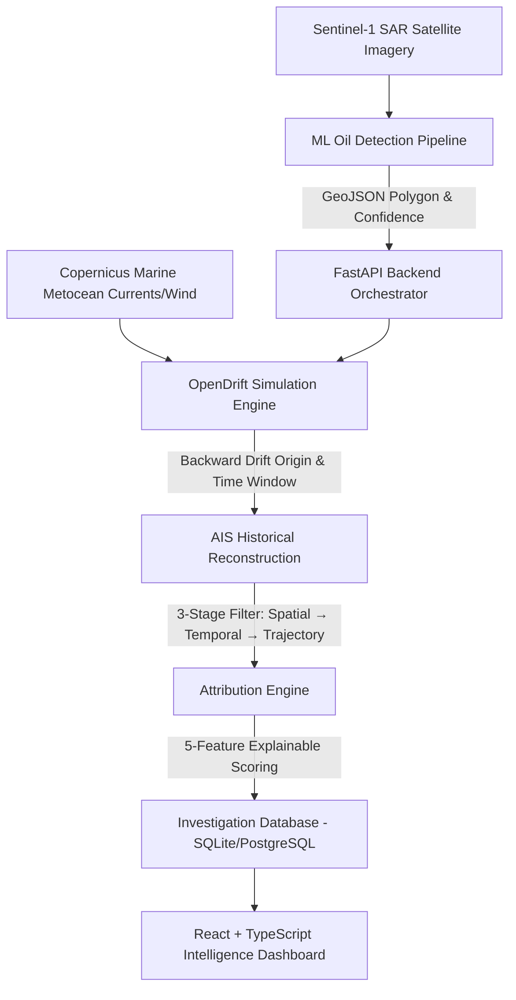

# 🛰️ MarineTrace — Project Architecture & Directory Structure

Comprehensive reference guide showcasing the reorganized layout, module responsibilities, and data flow of the **MarineTrace** AI-powered marine oil-spill detection and vessel attribution platform.

---

## 🌟 Executive System Overview



---

## 📁 Repository Directory Structure

```
MarineTrace/
├── .env                              # Environment variable configuration (API keys, ports, weights)
├── docker-compose.yml                # Multi-container orchestration (Backend, Frontend, PostGIS)
├── marinetrace.db                    # SQLite investigation persistence database
├── package.json                      # (If applicable) Root tooling configuration
├── README.md                         # Main project overview and getting started guide
├── PROJECT_STRUCTURE.md              # Complete architecture & directory reference (this file)
├── run_demo.py                       # Standalone end-to-end CLI demonstration runner
│
├── backend/                          # 🐍 FastAPI Backend & Simulation Engines
│   ├── Dockerfile                    # Container definition for backend services
│   ├── requirements.txt              # Python production & geospatial dependencies
│   ├── ais/                          # 🚢 AIS Vessel Tracking & Filtering Engine
│   │   ├── client.py                 # Datalastic AIS API client + synthetic fallback generator
│   │   ├── filtering.py              # 3-Stage filtering pipeline (Spatial, Temporal, Trajectory)
│   │   └── trajectory.py             # Trajectory interpolation, course, & speed anomaly detection
│   ├── app/                          # 🌐 FastAPI Core Application Layer
│   │   ├── main.py                   # App entrypoint, lifespan, CORS, and router mounting
│   │   ├── api/                      # REST API endpoints & route handlers
│   │   │   ├── dependencies.py       # Dependency injection (settings, services)
│   │   │   └── routes/               # Modular route controllers
│   │   │       ├── drift.py          # /drift/backward & /drift/forward endpoints
│   │   │       ├── health.py         # /ping health check endpoint
│   │   │       ├── investigation.py  # /investigate, /demo/investigation, /investigation/{id}
│   │   │       └── vessels.py        # /vessels/search AIS query endpoints
│   │   ├── core/                     # Core settings, constants, and structured logging
│   │   │   ├── config.py             # Pydantic BaseSettings loaded from .env
│   │   │   └── logging.py            # Unified structured logging configuration
│   │   ├── db/                       # Database repository & persistence layer
│   │   │   └── repository.py         # SQLite & PostgreSQL InvestigationRepository abstraction
│   │   ├── models/                   # Pydantic data schemas & GeoJSON types
│   │   │   ├── drift.py              # DriftResult, DriftTrajectory, DriftOrigin models
│   │   │   ├── investigation.py      # InvestigationRequest & InvestigationResponse schemas
│   │   │   ├── spill.py              # SpillDetection, SpillSummary, GeoJSONGeometry
│   │   │   └── vessel.py             # VesselTrack, VesselPosition, FeatureScores, VesselAttribution
│   │   ├── services/                 # Business logic & domain service orchestrators
│   │   │   ├── ais_service.py        # AIS query & filtering coordinator
│   │   │   ├── attribution_service.py# Attribution engine coordinator
│   │   │   ├── drift_service.py      # OpenDrift & geometric drift orchestrator
│   │   │   ├── environmental_service.py # Copernicus Metocean data fetcher
│   │   │   └── ml_client.py          # HTTP client for ML pipeline (with MockMLClient fallback)
│   │   └── utils/                    # Geospatial & temporal math utilities
│   │       ├── geo.py                # Haversine, polygon distance, bounding box calculations
│   │       └── time.py               # ISO-8601 parsing & time window helpers
│   ├── attribution/                  # ⚖️ Multi-Feature Attribution Engine
│   │   ├── features.py               # 5-factor feature extractors (Spatial, Temporal, Trajectory, Behaviour, Relevance)
│   │   ├── scoring.py                # Sigmoidal scoring & weighted aggregation
│   │   └── ranking.py                # Candidate ranking & natural language justification generator
│   ├── data/                         # Static demo datasets
│   │   └── demo/                     # Pre-cached demonstration scenarios
│   ├── drift/                        # 🌊 Oceanographic Drift Modeling
│   │   ├── backtracking.py           # Reverse Lagrangian particle simulation to locate spill origin
│   │   ├── forecasting.py            # Forward trajectory forecasting for containment planning
│   │   └── opendrift_runner.py       # Wrapper for OpenDrift physical model integration
│   └── tests/                        # 🧪 Automated Pytest Test Suite
│       ├── test_ais.py               # Tests for AIS filtering & trajectory analysis
│       ├── test_api.py               # FastAPI endpoint tests
│       ├── test_attribution.py       # Attribution scoring & ranking unit tests
│       ├── test_drift.py             # Drift simulation tests
│       └── test_ml_client.py         # ML client integration tests
│
├── frontend/                         # ⚛️ React 19 + TypeScript + Vite Dashboard
│   ├── Dockerfile                    # Container definition for frontend Nginx/preview
│   ├── index.html                    # HTML entry point with viewport & meta tags
│   ├── package.json                  # NPM dependencies (React 19, Leaflet, Recharts, Lucide, Tailwind v4)
│   ├── tsconfig.json                 # TypeScript compiler configuration
│   ├── vite.config.ts                # Vite build tool configuration with Tailwind plugin
│   ├── public/                       # Static public assets
│   │   ├── favicon.svg               # MarineTrace satellite logo
│   │   └── icons.svg                 # SVG sprite sheet
│   └── src/                          # TypeScript source code
│       ├── main.tsx                  # React application root mounting
│       ├── App.tsx                   # Main router, navigation layout, & global modals
│       ├── index.css                 # Design system tokens, glassmorphism, & animations
│       ├── api/                      # Modular API client layer
│       │   ├── client.ts             # Generic fetch wrapper with error handling & base URL
│       │   ├── drift.ts              # Drift simulation API calls
│       │   ├── investigations.ts     # Full investigation execution & retrieval
│       │   ├── spills.ts             # Spill detection endpoints
│       │   └── vessels.ts            # Vessel track query endpoints
│       ├── assets/                   # Images and branding assets
│       ├── components/               # Organized domain-specific UI components
│       │   ├── charts/               # Analytics & data visualizers
│       │   │   └── AttributionRadarChart.tsx # 5-factor attribution radar chart
│       │   ├── drift/                # Drift simulation controls & readouts
│       │   │   ├── DriftTimelineControl.tsx # Step-by-step drift particle player
│       │   │   └── EnvironmentalConditionsCard.tsx # Wind, current, and wave metrics card
│       │   ├── layout/               # Shell layout components
│       │   │   ├── Sidebar.tsx       # Primary collapsible navigation sidebar
│       │   │   └── TopNav.tsx        # Breadcrumb, status indicator, and quick actions
│       │   ├── map/                  # Leaflet geospatial mapping suite
│       │   │   ├── MapBasemapSelector.tsx # Satellite, dark ocean, and nautical chart switcher
│       │   │   ├── MapCoordinateHUD.tsx   # Real-time cursor coordinates & zoom HUD
│       │   │   ├── MapLayerControls.tsx   # Toggleable layers (SAR, Slick, Drift, AIS, Heatmap)
│       │   │   ├── MapLegend.tsx          # Color-coded interactive map legend
│       │   │   ├── MapMeasureTool.tsx     # Distance & geodesic measuring tool
│       │   │   ├── MapSearchBar.tsx       # Coordinate and vessel search bar
│       │   │   ├── MaritimeMap.tsx        # High-performance Leaflet container with GeoJSON layers
│       │   │   └── MaritimeOverlays.tsx   # EEZ boundaries, shipping lanes, MPAs, bathymetry
│       │   ├── ml/                   # Machine learning metrics & inspection components
│       │   │   └── MLModelCard.tsx   # U-Net confidence, IoU, and patch metrics
│       │   ├── satellite/            # Satellite imagery components
│       │   │   ├── SARMetricsBadge.tsx    # Polarization (VV/VH), incidence angle badge
│       │   │   └── SatelliteViewer.tsx    # Split-screen comparison & SAR patch inspector
│       │   ├── spill/                # Detected oil slick components
│       │   │   └── SpillInfoPanel.tsx     # Slick area, confidence, coordinates, and shape metrics
│       │   ├── timeline/             # Temporal inspection
│       │   │   └── InvestigationTimeline.tsx # Incident timeline from release to observation
│       │   ├── ui/                   # Reusable base UI primitives & feedback modals
│       │   │   ├── ConfidenceGauge.tsx    # Radial SVG score gauge
│       │   │   └── PipelineProgressModal.tsx # Live step-by-step pipeline status overlay
│       │   └── vessel/               # Vessel attribution inspection
│       │       ├── ScoreBreakdownBar.tsx  # Stacked 5-feature contribution bar
│       │       ├── VesselDetailPanel.tsx  # Deep dive into suspect vessel history, MMSI, flag, anomaly
│       │       └── VesselRankList.tsx     # Ranked suspect vessel leaderboard with priority medals
│       ├── context/                  # State management
│       │   └── InvestigationContext.tsx # Central store for active investigation, layers, & filters
│       ├── data/                     # Demo scenarios & fallback mocks
│       │   └── demo/demoData.ts      # Offline demo dataset for presentations
│       ├── pages/                    # Main application view pages
│       │   ├── Dashboard.tsx         # Unified overview dashboard
│       │   ├── DriftAnalysis.tsx     # Backward & forward drift simulation workbench
│       │   ├── Investigation.tsx     # Full interactive map + attribution investigation workbench
│       │   ├── NewInvestigation.tsx  # Upload GeoTIFF / manual coordinate investigation launcher
│       │   ├── Reports.tsx           # Formal investigative report generation & PDF export
│       │   ├── SatelliteImagery.tsx  # Sentinel-1 SAR imagery browser & patch viewer
│       │   └── VesselAttribution.tsx # Deep-dive vessel ranking and trajectory analysis
│       ├── services/                 # Re-exported legacy service layer
│       │   └── api.ts                # Unified API service exports
│       └── types/                    # TypeScript interfaces & GeoJSON definitions
│           └── investigation.ts      # InvestigationResponse, Vessel, Spill, Drift, Layer types
│
├── ml/                               # 🧠 Sentinel-1 SAR Oil Spill Detection Pipeline
│   ├── config.yaml                   # Model hyperparameters, patch size, loss weights
│   ├── requirements.txt              # ML dependencies (PyTorch, SMP, scikit-image, GDAL/Rasterio)
│   ├── run_all_tests.py              # ML validation pipeline test runner (21 checks)
│   ├── inspect_compatibility.py      # Architecture compatibility evaluator
│   ├── README.md                     # ML pipeline technical documentation
│   ├── checkpoints/                  # Model weights storage
│   │   └── best_model.pth            # Trained U-Net ResNet-34 checkpoint weights
│   ├── data/                         # Sample datasets & test fixtures
│   │   ├── sample_s1.tif             # Sample Sentinel-1 dual-pol GeoTIFF
│   │   └── test_synthetic/           # Synthetic SAR patch generation
│   ├── evaluation/                   # Model validation & benchmark scripts
│   │   └── evaluate.py               # Precision, recall, F1, and IoU evaluation
│   ├── features/                     # Morphological & spatial feature extraction
│   │   └── candidate_features.py     # Slick length, width, spreading ratio, perimeter
│   ├── inference/                    # Model inference & production API
│   │   ├── api_interface.py          # JSON API contract matching backend expectations
│   │   └── predict.py                # Command-line GeoTIFF inference runner
│   ├── models/                       # Deep learning neural network architectures
│   │   └── unet.py                   # U-Net with ResNet-34 encoder (dual-pol VV/VH input)
│   ├── preprocessing/                # SAR satellite pre-processing
│   │   ├── patch_dataset.py          # Tiled patch dataset loader with overlap
│   │   └── sar_preprocessing.py      # Radiometric calibration, speckle filter, decibel scale
│   ├── results/                      # Evaluation outputs & metrics
│   │   ├── evaluation_results.json   # Benchmark summary
│   │   ├── metrics.json              # Validation metrics
│   │   └── sample_s1_result.json     # Sample detection GeoJSON output
│   ├── tests/                        # ML unit tests
│   │   └── test_pipeline.py          # Smoke tests for tensor shapes & inference
│   ├── training/                     # Model training & optimization
│   │   ├── augmentations.py          # Spatial & radiometric augmentations
│   │   ├── losses.py                 # Compound loss (BCE + Dice + Focal Loss)
│   │   └── train_unet.py             # PyTorch training loop with early stopping
│   └── visualization/                # Plotting & inspection utilities
│       └── visualize.py              # Overlay SAR intensity + detection mask
│
└── docs/                             # 📚 Technical Documentation & System Specifications
    ├── API_CONTRACT.md               # Strict REST API specification & JSON schema definitions
    ├── ARCHITECTURE.md               # End-to-end system architecture & algorithm details
    ├── CODEBASE_EXPLAINED.md         # Comprehensive module-by-module documentation
    └── DOCKER_GUIDE.md               # Containerization, deployment, & cloud hosting guide
```

---

## ⚡ Quick Execution Guide

### 1. Run Complete CLI Demo
```bash
python run_demo.py
```

### 2. Run Backend API Server
```bash
cd backend
source venv/bin/activate
uvicorn app.main:app --reload --port 8000
```

### 3. Run Frontend Dashboard
```bash
cd frontend
npm install
npm run dev
```

### 4. Run Automated Backend Tests
```bash
cd backend
pytest tests/
```

### 5. Run Full ML Validation Suite
```bash
cd ml
python run_all_tests.py
```
