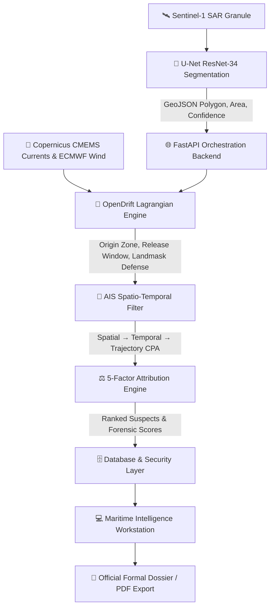

# 🛰️ MarineTrace

<div align="center">

**Professional Maritime Oil-Spill Intelligence & Forensic Investigation Workstation**

[](https://www.python.org/)
[](https://fastapi.tiangolo.com/)
[](https://react.dev/)
[](https://www.typescriptlang.org/)
[](https://pytorch.org/)
[](https://vitejs.dev/)
[](https://www.docker.com/)
[](backend/tests/)

[**Explore Architecture**](docs/ARCHITECTURE.md) • [**API Contract**](docs/API_CONTRACT.md) • [**Project Structure**](PROJECT_STRUCTURE.md) • [**Docker Guide**](docs/DOCKER_GUIDE.md)

</div>

---

## 🌊 Overview

**MarineTrace** is a purpose-built maritime intelligence and forensic investigation workstation combining Sentinel-1 Synthetic Aperture Radar (SAR) Earth Observation analysis, hydrodynamic drift backtracking (OpenDrift), historical AIS vessel tracking, and explainable 5-factor attribution scoring.

Designed for Coast Guard authorities, maritime investigators, oceanographic analysts, and environmental compliance officers, MarineTrace automates the detection of illicit bilge dumping, localizes discharge envelopes, and prioritizes suspect vessels with audit-ready legal dossiers.

> ⚠️ **Statutory Advisory**: MarineTrace provides **investigative decision-support intelligence rankings**, not final judicial adjudication.

---

## 🌟 Core System Capabilities

### 1. 🛰️ Sentinel-1 SAR Oil Slick Detection (Computer Vision)
- **Dual-Polarization Input**: Ingests calibrated Ground Range Detected (GRD) backscatter rasters ($\sigma^0_{\text{VV}}$, $\sigma^0_{\text{VH}}$ in dB).
- **Deep Segmentation Network**: U-Net architecture with an ImageNet-pretrained ResNet-34 encoder backbone (24.4M parameters).
- **Morphological Extraction**: Automated connected-component candidate extraction, speckle filtering, and geodetic surface area calculation ($\text{km}^2$).
- **Look-Alike Verification**: Contrast damping ratio evaluation against the Zenodo 450-scene benchmark (Dice: 0.87, IoU: 0.79, Accuracy: 0.96).

### 2. 🌊 Hydrodynamic Advection & Drift Physics (OpenDrift)
- **500-Particle Lagrangian Monte Carlo Ensemble**: Simulates turbulent diffusion and current advection across time steps.
- **Metocean Forcing Integration**: Forced by Copernicus Marine Service (CMEMS Global 1/12° surface currents) and ECMWF ERA5 10-meter surface vector wind fields.
- **Reverse Hindcast ($T_{\text{obs}} \to T_0$)**: Inverts velocity vectors to estimate the probable geodetic coordinates and time window of discharge.
- **Forward Forecast ($T_{\text{obs}} \to T_{+24\text{h}}$)**: Predicts slick dispersion, coastal landfall trajectories, and environmental containment zones.
- **Global Obstacle Deflection**: Integrated Rust-based `RoaringLandmask` core for realistic coastline avoidance and navigation channel routing.

### 3. 🚢 AIS Traffic Reconstruction & 3-Stage Filtering
- **Multi-Stage Candidate Filtering**:
  1. *Spatial Geodesic Filter*: Narrows candidates to a $25\text{ km}$ bounding radius around the discharge origin.
  2. *Temporal Coincidence Window*: Identifies vessels present during the release interval.
  3. *Trajectory Intercept (CPA)*: Calculates Closest Point of Approach and intersection angles.
- **Transponder Kinematic Interpolation**: Continuous high-frequency trajectory smoothing across reporting intervals.

### 4. ⚖️ 5-Factor Explainable Attribution Model
All candidates are evaluated across five weighted, auditable forensic dimensions:

$$\text{Score} = 0.30 \cdot S_{\text{spatial}} + 0.25 \cdot S_{\text{temporal}} + 0.20 \cdot S_{\text{trajectory}} + 0.15 \cdot S_{\text{behaviour}} + 0.10 \cdot S_{\text{relevance}}$$

- 📍 **Spatial Proximity (30%)**: Distance from vessel track to estimated discharge origin coordinates.
- ⏱️ **Temporal Coincidence (25%)**: Alignment with the release time window estimated by OpenDrift.
- 📈 **Trajectory Intercept (20%)**: Geometric alignment between vessel route and slick elongation vector.
- ⚡ **Behavioural Anomaly (15%)**: Speed drops and maneuvers characteristic of illicit bilge pumping.
- 🚢 **Vessel Risk Relevance (10%)**: Vessel type risk weighting (Crude Oil Tanker, Chemical Carrier, Bulk Cargo).

### 5. 📑 Official Incident Intelligence Dossier (PDF / Print Engine)
- **Formal White Paper Report**: Clean `#ffffff` paper card layout with official classification stamp (`OFFICIAL // SENSITIVE`), executive determination, SAR sensor metadata, hydrodynamic forcing tables, ranked attribution matrix, model benchmark verification, and investigator sign-off blocks.
- **PDF Print Isolation**: Fully automated `@media print` rules that completely suppress the navigation header, sidebar, and application shell to output pristine A4 multi-page PDFs.

### 6. 💻 Professional Maritime Workstation UI
- **Refined Slate Design System**: Built with clean `Inter` typography, monospaced tabular numerals (`JetBrains Mono`), and high-density slate-graphite workstation panels (`#0c1017`, `#111622`, `#161e2e`, `#1e293b`).
- **Dynamic Light & Dark Theme Engine**: Instant reactive switching between Dark Workstation and Clean Enterprise Light modes with local persistence.
- **Interactive Full-Bleed GIS Canvas**: Leaflet GIS map with floating layer controls, basemap switchers, and symbology legend.

---

## 🏗️ Architecture & Pipeline Flow



---

## ⚡ Quick Start

### 1. Prerequisites
- **Python**: 3.10+
- **Node.js**: 18+ & npm
- **Docker & Docker Compose** (optional, for full-stack containerization)

---

### 2. Standalone CLI Investigation Demo (Zero Setup)
Execute the complete end-to-end investigation pipeline directly from your terminal:
```bash
python run_demo.py
```

---

### 3. Running Backend Service
```bash
cd backend
python3 -m venv venv
source venv/bin/activate  # Windows: venv\Scripts\activate
pip install -r requirements.txt
cp ../.env.example ../.env  # Configure keys if desired
uvicorn app.main:app --reload --host 0.0.0.0 --port 8000
```
- **Backend API**: `http://localhost:8000`
- **Interactive Swagger Docs**: `http://localhost:8000/docs`
- **Health Probe**: `http://localhost:8000/ping`

---

### 4. Running Frontend Workstation
```bash
cd frontend
npm install
npm run dev
```
- **Workstation Console**: `http://localhost:5173`

---

### 5. Running Full-Stack with Docker Compose
```bash
docker compose up --build
```

---

## 🧪 Testing & Verification Suites

All test suites across Machine Learning, Backend, and Frontend build checks:

```bash
# 1. Run Machine Learning Pipeline Suite (36/36 tests)
PYTHONPATH=ml backend/venv/bin/python3 -m pytest ml/tests -v

# 2. Run Backend & Security Suite (48/48 tests)
PYTHONPATH=backend backend/venv/bin/python3 -m pytest backend/tests -v

# 3. Run Frontend Type-Check & Production Build
npm --prefix frontend run build
```

| Layer | Test Suite | Items Tested | Status |
| :--- | :--- | :--- | :--- |
| **Backend & Security** | `backend/tests/` | 48 tests | ✅ **100% PASSED** |
| **Machine Learning** | `ml/tests/` | 36 tests | ✅ **100% PASSED** |
| **Frontend Application** | TypeScript + Vite | 2,460 modules | ✅ **0 ERRORS (235ms)** |

---

## 📁 Project Structure

For complete details on every subsystem, see **[PROJECT_STRUCTURE.md](PROJECT_STRUCTURE.md)**.

```
MarineTrace/
├── backend/              # 🐍 FastAPI Backend & Simulation Engines
│   ├── app/              # API routers, Pydantic schemas, security, repository
│   ├── ais/              # AIS client, trajectory analysis, RoaringLandmask
│   ├── attribution/      # 5-factor scoring engine & ranking
│   ├── drift/            # OpenDrift Lagrangian backtracking & forecasting
│   └── tests/            # Automated pytest backend test suite
├── frontend/             # ⚛️ React 19 + TypeScript + Vite Maritime Workstation
│   ├── src/api/          # Modular API client endpoints
│   ├── src/components/   # GIS map, floating toolbars, satellite studio, vessel cards
│   ├── src/pages/        # Dashboard, Investigation, Drift, Attribution, SAR, Reports, Logs
│   ├── src/context/      # Investigation & Theme state stores
│   └── src/types/        # TypeScript domain interfaces
├── ml/                   # 🧠 Sentinel-1 SAR Oil Spill Detection Pipeline
│   ├── models/           # U-Net ResNet-34 segmentation network
│   ├── preprocessing/    # Dual-pol radiometric calibration & patch extraction
│   ├── features/         # Morphological feature extraction
│   ├── inference/        # JSON API interface & predict runners
│   ├── training/         # Loss functions (Dice + BCE) & training loops
│   ├── checkpoints/      # Model weights (best_model.pth)
│   └── tests/            # Automated ML validation test suite
├── docs/                 # 📚 Architecture, Docker, and API specifications
├── docker-compose.yml    # Multi-container orchestration
├── marinetrace.db        # SQLite database with WAL mode
└── run_demo.py           # Standalone CLI investigation runner
```

---

## 🔌 API Specification

| Method | Path | Description |
| :--- | :--- | :--- |
| `GET` | `/ping` | Health check probe (`{"status": "ok"}`) |
| `POST` | `/investigate` | Run end-to-end SAR detection, drift simulation, and AIS correlation |
| `POST` | `/demo/investigation` | Execute pre-cached deterministic investigation scenario |
| `GET` | `/investigations` | List historical investigation records |
| `GET` | `/investigation/{id}` | Retrieve specific investigation case file |
| `POST` | `/drift/backward` | Run Lagrangian reverse drift origin backtracking |
| `POST` | `/drift/forward` | Run forward drift trajectory dispersion forecast |
| `GET` | `/vessels/search` | Query AIS vessel traffic by bounding box and time window |
| `GET` | `/sar/scenes/{id}` | Ingest and inspect Sentinel-1 SAR scene metadata and masks |

---

## 📄 License & Attribution

Internal hackathon / research decision-support platform — Smart India Hackathon 2026.  
Built for maritime authorities, Coast Guard operations, and marine environmental investigators.
