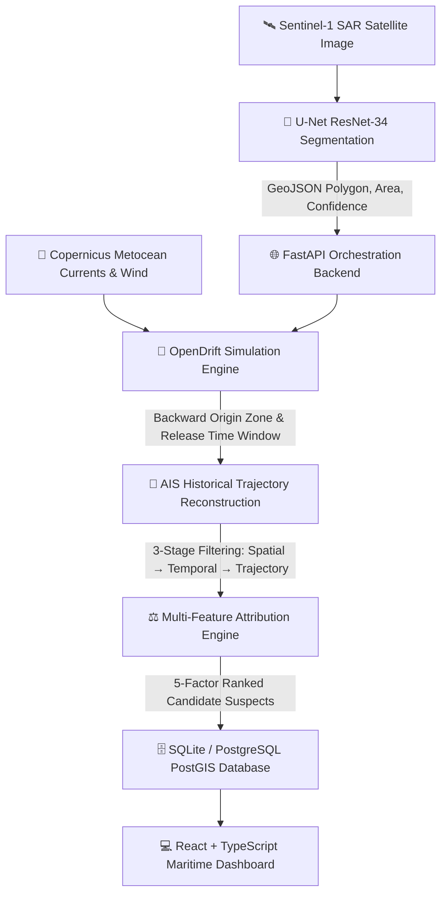

# 🛰️ MarineTrace

<div align="center">

**AI-Powered Marine Oil-Spill Detection & Vessel Attribution System**

[](https://www.python.org/)
[](https://fastapi.tiangolo.com/)
[](https://react.dev/)
[](https://www.typescriptlang.org/)
[](https://pytorch.org/)
[](https://vitejs.dev/)
[](https://www.docker.com/)

[**Explore Architecture**](docs/ARCHITECTURE.md) • [**API Contract**](docs/API_CONTRACT.md) • [**Project Structure**](PROJECT_STRUCTURE.md) • [**Docker Guide**](docs/DOCKER_GUIDE.md)

</div>

---

## 🌊 Overview

**MarineTrace** combines Sentinel-1 Synthetic Aperture Radar (SAR) satellite imagery analysis, oceanographic drift backtracking (OpenDrift), historical AIS vessel tracking, and explainable multi-feature attribution scoring to help maritime authorities, coast guards, and environmental investigators identify potential sources of marine oil spills.

> ⚠️ **Disclaimer**: MarineTrace provides **investigative decision-support priority rankings**, not legal adjudication.

---

## 🌟 Key Capabilities

- **🛰️ Sentinel-1 SAR Oil Slick Detection**: Dual-polarization ($\sigma^0_{\text{VV}}$, $\sigma^0_{\text{VH}}$ in dB) U-Net semantic segmentation network with an ImageNet-pretrained ResNet-34 backbone (24.4M parameters) for high-accuracy slick delineation.
- **🌊 Backward & Forward Drift Modeling**: Lagrangian particle simulation modeling ocean surface currents and wind drift to backtrack oil slicks to their estimated origin and predict future trajectory for containment.
- **🚢 AIS Traffic Reconstruction & 3-Stage Filtering**: Filters vessel traffic across Spatial ($R \le 25\text{ km}$), Temporal (release time window), and Trajectory intersection criteria.
- **⚖️ 5-Factor Explainable Attribution Scoring**:
  - 📍 **Spatial Proximity (30%)**: Distance between vessel track and estimated spill origin.
  - ⏱️ **Temporal Coincidence (25%)**: Presence during the estimated release time window.
  - 📈 **Trajectory Correlation (20%)**: Geometric alignment between vessel path and slick shape.
  - ⚡ **Behavioural Anomaly (15%)**: Sudden speed or course changes indicative of illegal discharge.
  - 🚢 **Vessel Risk Relevance (10%)**: Vessel type risk weighting (Tankers, Cargo, Fishing).
- **🗺️ Interactive Maritime Intelligence Dashboard**: High-performance React 19 + Leaflet GIS console featuring bathymetry overlays, shipping lanes, EEZ boundaries, drift time-slider replay, and formal PDF report generation.

---

## 🏗️ Architecture & Pipeline Flow



---

## ⚡ Quick Start

### 1. Prerequisites
- Python 3.10+
- Node.js 18+ & npm
- Docker (optional, for full-stack container deployment)

### 2. Standalone CLI Demo Runner (Zero-Setup)
Run the entire end-to-end investigation pipeline immediately from the terminal:
```bash
python run_demo.py
```

---

### 3. Running Backend API
```bash
cd backend
python -m venv venv
source venv/bin/activate  # Windows: venv\Scripts\activate
pip install -r requirements.txt
cp ../.env.example ../.env   # Configure your AIS / Copernicus keys if desired
uvicorn app.main:app --reload --port 8000
```
*Backend Swagger documentation available at: `http://localhost:8000/docs`*

---

### 4. Running Frontend Dashboard
```bash
cd frontend
npm install
npm run dev
```
*Frontend application available at: `http://localhost:5173`*

---

### 5. Running ML Pipeline Validation & Tests
```bash
cd ml
pip install -r requirements.txt
python run_all_tests.py
```

---

### 6. Full-Stack with Docker Compose
```bash
docker compose up --build
```

---

## 📁 Project Directory Structure

For an in-depth reference of every file and module, see **[PROJECT_STRUCTURE.md](PROJECT_STRUCTURE.md)**.

```
MarineTrace/
├── backend/              # 🐍 FastAPI Backend & Simulation Engines
│   ├── app/              # Core API routers, Pydantic models, services, repository
│   ├── ais/              # AIS client, trajectory analysis, & 3-stage filtering
│   ├── attribution/      # 5-factor scoring engine & vessel ranking
│   ├── drift/            # OpenDrift Lagrangian backtracking & forecasting
│   └── tests/            # Automated pytest test suite
├── frontend/             # ⚛️ React 19 + TypeScript + Vite Maritime Dashboard
│   ├── src/api/          # Modular API client endpoints
│   ├── src/components/   # GIS mapping, charts, satellite inspector, vessel cards
│   ├── src/pages/        # Dashboard, Investigation, Drift, Reports, Satellites
│   └── src/context/      # Global investigation state store
├── ml/                   # 🧠 Sentinel-1 SAR Oil Spill Detection Pipeline
│   ├── models/           # U-Net ResNet-34 segmentation network
│   ├── preprocessing/    # Dual-pol radiometric calibration & patch extraction
│   ├── features/         # Geometric & morphological slick feature extractors
│   ├── inference/        # Pure JSON API interface & predict CLI runners
│   ├── training/         # Custom loss functions & PyTorch training loops
│   ├── checkpoints/      # Model weights (best_model.pth)
│   └── tests/            # Automated ML validation test suite
├── docs/                 # 📚 System documentation (API contract, Docker, Architecture)
├── docker-compose.yml    # Multi-container orchestration
├── marinetrace.db        # SQLite database for past investigations
└── run_demo.py           # Standalone CLI investigation runner
```

---

## 🔌 API Endpoints

| Method | Path | Description |
| :--- | :--- | :--- |
| `GET` | `/ping` | Health check probe |
| `POST` | `/investigate` | Execute live multi-stage investigation pipeline |
| `POST` | `/demo/investigation` | Run deterministic pre-cached demo investigation |
| `GET` | `/investigations` | List recent investigation records |
| `GET` | `/investigation/{id}` | Retrieve specific investigation by ID |
| `POST` | `/drift/backward` | Run backward Lagrangian drift origin backtracking |
| `POST` | `/drift/forward` | Run forward drift trajectory prediction |
| `GET` | `/vessels/search` | Query AIS vessel traffic by bounding box and time window |

---

## 🧪 Testing & Validation

```bash
# Run backend test suite
PYTHONPATH=backend pytest backend/tests

# Run ML pipeline unit tests
PYTHONPATH=ml pytest ml/tests

# Run 21-step ML validation pipeline
cd ml && python run_all_tests.py

# Run frontend build check
cd frontend && npm run build
```

---

## 📄 License & Attribution

Internal hackathon / research decision-support platform — Smart India Hackathon 2026.
Built for maritime authorities, Coast Guard, and marine pollution investigators.
